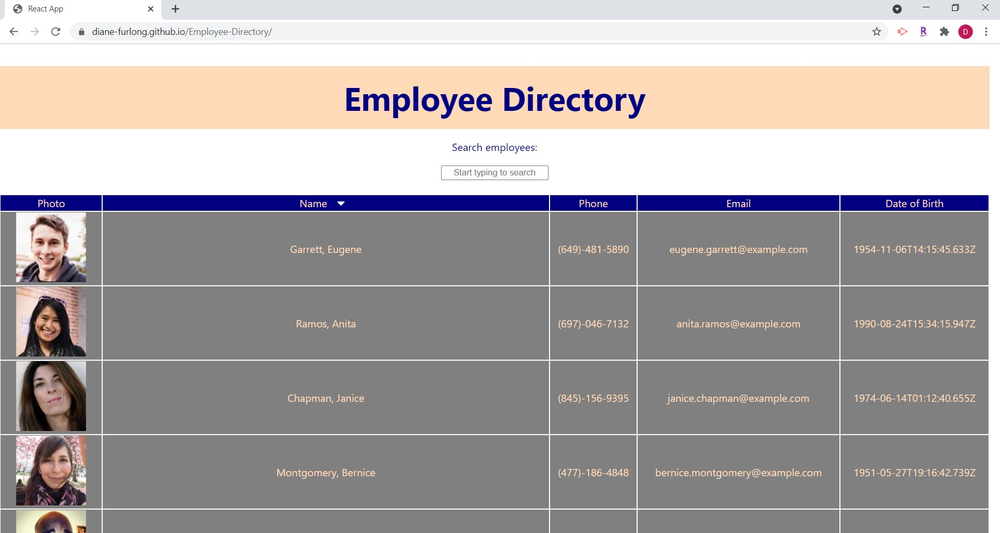

# Employee-Directory

# Employee-Directory
    
## Description
    
This application is an employee directory to quickly access information on a list of personnel. Users can view the entire employee directory, or can filter by name to search for certain employees. Users can also sort employees in either ascending or descending alphabetical order.

This application is built using React. The application's UI is broken into components, and these components have managed states. They also respond to the user events above (i.e. filtering, sorting).

This application is deployed to GitHub Pages (see [Usage](#usage) tab for link).
       

## Table of Contents
    
* [Installation](#installation)
    
* [Usage](#usage)
    
* [Contributions](#contributions)
    
* [Tests](#tests)
    
* [License](#license)
    
* [Contact](#contact)
    
    
## Installation
    
If running application locally, this requires "npm i" in the command terminal to install dependencies.
    
    
## Usage
    
The deployed application can be found here: https://diane-furlong.github.io/Employee-Directory

Image of application:

    
## Contributions
    
Contributions are welcome in the form of suggestions.
    
    
## Tests
    
There are no test procedures for this application.
    
    
## License
None
    
    
## Contact
Questions? Contact me at:
 
GitHub username: diane-furlong  
Email address: dfurlongm@gmail.com
